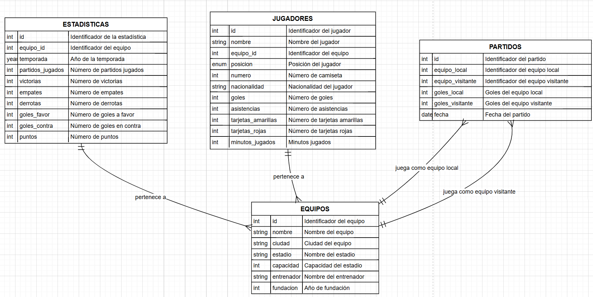
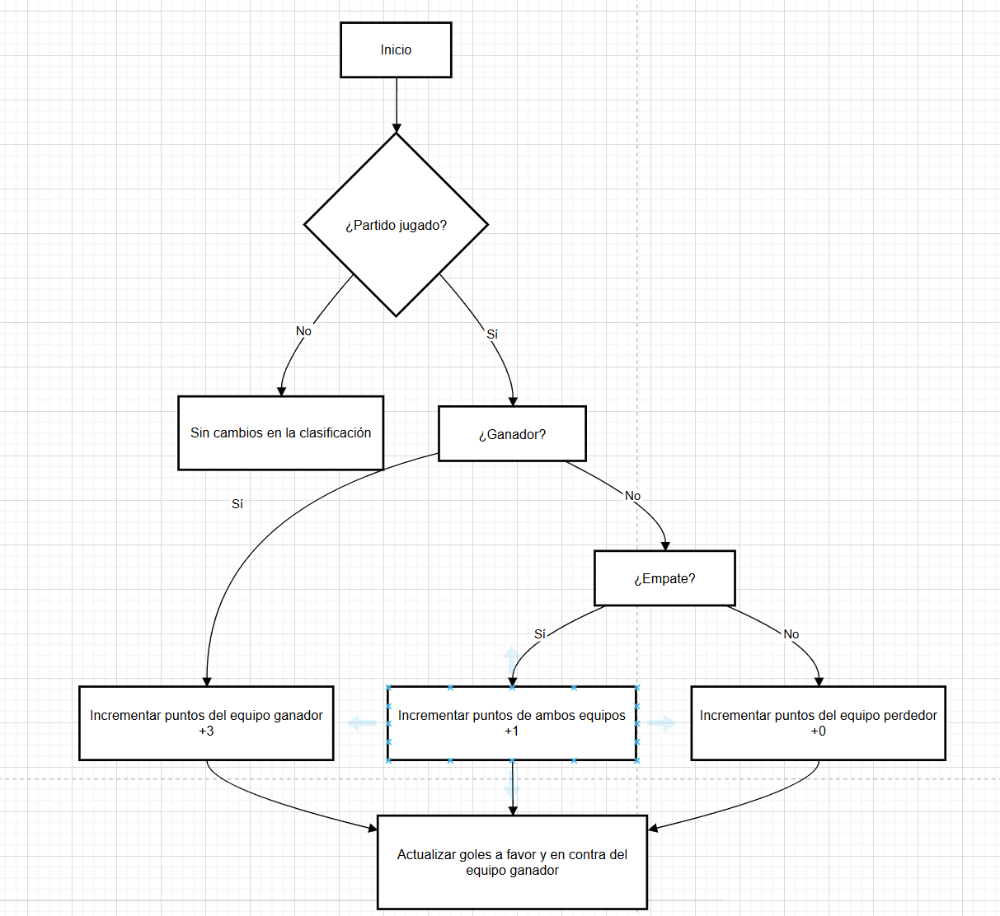
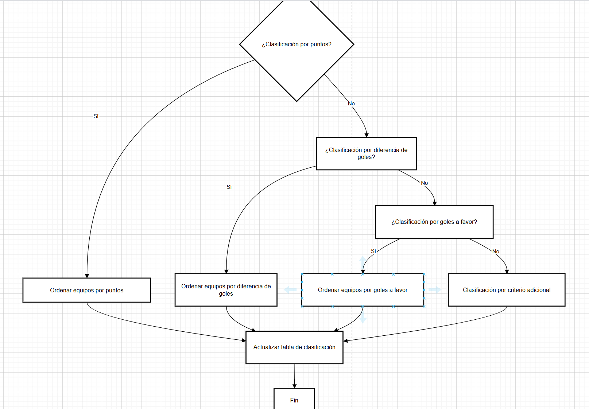

# DOCUMENTACION api_laliga

## 1. DEFINICION DE ENDPOINTS

### /equipos

**GET** - TODOS LOS EQUIPOS:
- **URL**: http://localhost/Proyecto/api_laliga.php/equipos

**POST** - INSERTAR EQUIPOS:
- **URL**: http://localhost/Proyecto/api_laliga.php/equipos
- **JSON**:
    ```json
    {
        "nombre": "Equipo Nuevo",
        "ciudad": "Ciudad Ejemplo",
        "estadio": "Estadio Ejemplo",
        "capacidad": 50000,
        "entrenador": "Entrenador Ejemplo",
        "fundacion": 2024
    }
    ```

**DELETE** - BORRAR EQUIPO:
- **URL**: http://localhost/Proyecto/api_laliga.php/equipos?equipo_id=22

### /jugadores

**GET** - TODOS LOS JUGADORES:
- **URL**: http://localhost/Proyecto/api_laliga.php/jugadores

**GET** - DETALLES DE UN JUGADOR:
- **URL**: http://localhost/Proyecto/api_laliga.php/jugadores?id=2

**GET** - JUGADORES DE UN EQUIPO:
- **URL**: http://localhost/Proyecto/api_laliga.php/jugadores?equipo_id=2

**POST** - INSERTAR JUGADORES:
- **URL**: http://localhost/Proyecto/api_laliga.php/jugadores
- **JSON**:
    ```json
    {
        "nombre": "Jugador Ejemplo",
        "posicion": "Delantero",
        "equipo_id": 1,
        "numero": 9,
        "nacionalidad": "Española",
        "goles": 0,
        "asistencias": 0,
        "tarjetas_amarillas": 0,
        "tarjetas_rojas": 0,
        "minutos_jugados": 0
    }
    ```

**PUT** - CAMBIAR POSICIÓN JUGADOR:
- **URL**: http://localhost/Proyecto/api_laliga.php/jugadores
- **JSON**:
    ```json
    {
        "id": 2,
        "posicion": "Defensa" 
    }
    ```
    *_La posicion es un ENUM: Portero, Defensa, Centrocampista, Delantero_*

**DELETE** - BORRAR JUGADOR:
- **URL**: http://localhost/Proyecto/api_laliga.php/jugadores?id=401

### /partidos

**GET** - TODOS LOS PARTIDOS:
- **URL**: http://localhost/Proyecto/api_laliga.php/partidos

**GET** - PARTIDO ESPECÍFICO:
- **URL**: http://localhost/Proyecto/api_laliga.php/partidos?id=5

**POST** - INSERTAR PARTIDOS:
- **URL**: http://localhost/Proyecto/api_laliga.php/partidos
- **JSON**:
    ```json
    {
        "equipo_local": 1,
        "equipo_visitante": 2,
        "goles_local": 3,
        "goles_visitante": 1,
        "fecha": "2024-05-15"
    }
    ```

**DELETE** - BORRAR PARTIDO:
- **URL**: http://localhost/Proyecto/api_laliga.php/partidos?id=6

### /clasificacion

**GET** - CLASIFICACIÓN:
- **URL**: http://localhost/Proyecto/api_laliga.php/clasificacion

### /pichichi

**GET** - PICHICHI (máximo goleador):
- **URL**: http://localhost/Proyecto/api_laliga.php/pichichi

### /maxasistente

**GET** - MAX ASISTENTE (máximo asistente):
- **URL**: http://localhost/Proyecto/api_laliga.php/maxasistente

### /estadio

**PUT** - CAMBIAR ESTADIO y CAPACIDAD EQUIPO:
- **URL**: http://localhost/Proyecto/api_laliga.php/estadio
- **JSON**:
    ```json
    {
        "estadio": "Santiago Bernabeu",
        "capacidad": 81044
    }
    ```

### /entrenador

**PUT** - CAMBIAR ENTRENADOR EQUIPO:
- **URL**: http://localhost/Proyecto/api_laliga.php/entrenador
- **JSON**:
    ```json
    {
        "id": 1,
        "entrenador": "Santiago Solari"
    }
    ```

## COMO USAR LA API?

### EJEMPLO OBTENER CLASIFICACION

1. Abre Postman y crea una nueva petición.
2. Configura la petición como GET.
3. Introduce la URL de la API: http://localhost/Proyecto/api_laliga.php/clasificacion
4. Envía la petición.
5. JSON de respuesta:
     ```json
     [
         {
             "posicion": 1,
             "equipo": "Real Sociedad",
             "puntos": 3,
             "victorias": 1,
             "empates": 0,
             "derrotas": 0,
             "goles_favor": 2,
             "goles_contra": 0
         },
         {
             "posicion": 2,
             "equipo": "Atlético Madrid",
             "puntos": 3,
             "victorias": 1,
             "empates": 0,
             "derrotas": 0,
             "goles_favor": 2,
             "goles_contra": 0
         },
         
     ]
     ```

### EJEMPLO INSERTAR PARTIDO

1. Abre Postman y crea una nueva petición.
2. Configura la petición como Post.
3. Introduce la URL de la API: http://localhost/Proyecto/api_laliga.php/partidos.
4. En la pestaña "Body", selecciona "raw" y elige "JSON" en el menú desplegable.
5. Introduce el siguiente JSON en el cuerpo de la petición:
     ```json
     {
         "equipo_local": 15,
         "equipo_visitante": 9,
         "goles_local": 5,
         "goles_visitante": 3,
         "fecha": "2024-10-15"
     }
     ```
6. Envía la petición.
7. JSON de respuesta:
     ```json
     {
         "message": "Partido registrado y estadísticas actualizadas con éxito."
     }
     ```

### EJEMPLO CAMBIAR POSICION

1. Abre Postman y crea una nueva petición.
2. Configura la petición como Put.
3. Introduce la URL de la API: http://localhost/Proyecto/api_laliga.php/jugadores.
4. En la pestaña "Body", selecciona "raw" y elige "JSON" en el menú desplegable.
5. Introduce el siguiente JSON en el cuerpo de la petición:
     ```json
     {
         "id": 15,
         "posicion": "Delantero"
     }
     ```
6. Envía la petición.
7. JSON de respuesta:
     ```json
     {
         "message": "Posicion del jugador actualizada con éxito"
     }
     ```

### EJEMPLO BORRAR EQUIPO Y SUS JUGADORES

1. Abre Postman y crea una nueva petición.
2. Configura la petición como Delete.
3. Introduce la URL de la API: http://localhost/Proyecto/api_laliga.php/equipos?id=6
4. Envía la petición.
5. JSON de respuesta:
     ```json
     {
         "message": "Jugadores eliminados con éxito"
     }
     {
         "message": "Estadísticas eliminadas con éxito"
     }
     {
         "message": "Equipo eliminado con éxito"
     }
     ```

## 2. BASE DE DATOS
## MODEO RELACIONAL


## 3. LÓGICA DE NEGOCIO
### CREAR NUEVO PARTIDO


### CRITERIO CLASIFICACION


## 4. SEGURIDAD

Los usuarios sin token solo podrán ejecutar las peticiones GET. El administrador de la base de datos será el único conocedor del token necesario para realizar las demás peticiones.

[ArchivoSeguridad](Proyecto/seguridad.php)
